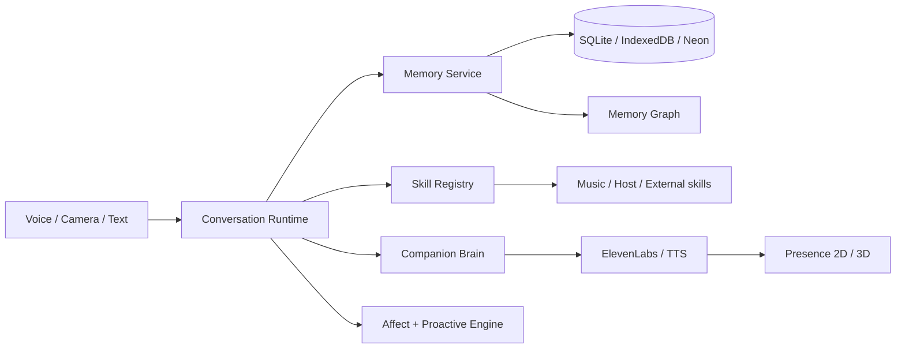

# Mira — Local-first AI Companion

<p align="center">
  
</p>

<p align="center"><strong>Voice-first · Emotion-aware · Long-term memory · Desktop local · Skills · Vision</strong></p>

<p align="center">
  
  
</p>

Mira là AI companion ưu tiên **giọng nói + continuity**: trò chuyện, ghi nhớ có kiểm soát, nhận biết tín hiệu cảm xúc, thực thi skill và chạy dưới dạng Web/PWA hoặc Desktop Windows/macOS.

## Trạng thái tổng thể

| Nhóm | Chức năng | Mức hoàn thiện | Điểm |
|---|---|:---:|:---:|
| Conversation | Voice-first, VAD, barge-in, turn manager | Stable | 9/10 |
| Voice | ElevenLabs + fallback TTS | Stable | 9/10 |
| Memory | Structured memory + active thread | Beta+ | 8/10 |
| Memory Graph | Liên kết context theo chủ đề/thời gian | Beta | 7.5/10 |
| Affect | Face/voice/posture + micro-expression | Beta | 7.5/10 |
| Companion | Proactive prompts + continuity | Beta | 7.5/10 |
| Desktop | Tauri local frontend + SQLite + permission gate | Beta+ | 8/10 |
| Music | Local library + history + contextual replay | Beta | 7.5/10 |
| Vision | Face / gaze / hand / pose | Beta | 8/10 |
| Spatial/XR | Webcam spatial + WebXR stack | Experimental | 6.5/10 |
| Presence | 2D scenes + optional VRM/3D | Beta | 8/10 |
| Security | Server-side secrets + capability/host policy | Beta+ | 8/10 |

Chi tiết: [`docs/FEATURE-MATRIX.md`](docs/FEATURE-MATRIX.md).

## Kiến trúc



## Desktop Local

- Tauri 2 + Vite frontend đóng gói local.
- SQLite `mira.db`: turns, episodes, structured memory, graph, affect, permissions, music history.
- Permission được kiểm tra lại ở Rust/native layer.
- Local Music Library chỉ scan thư mục người dùng chủ động chọn.
- Lệnh mẫu: _“Mở bài …”_, _“Bật lại bài hôm trước”_, _“Bật bài anh hay nghe lúc mệt”_.
- Affect từ camera chỉ là observation có confidence, không phải sự thật về cảm xúc.

> Release hiện chưa có production code-signing/notarization đầy đủ.

## Memory

`fact` · `preference` · `life_event` · `relationship_context` · `emotional_episode` · `active_thread`

Memory Graph dùng `co_occurs` + `semantic_temporal`. Durable personal memory chỉ lấy từ điều người dùng từng tự nói. Lệnh **“đừng nhớ / đừng lưu”** chặn persistence của turn và distillation tương ứng.

## Vision & Affect

Pipeline có face landmarks, gaze/head pose, hand/pose, FACS-like activity, micro-expression và affect fusion. Nhãn cảm xúc là **ước lượng có confidence**, không phải đọc suy nghĩ hay chẩn đoán.

## Chạy local

Yêu cầu **Node.js 24 LTS**.

```bash
nvm use
npm ci
npm run dev
```

Kiểm tra đầy đủ:

```bash
npm run check
```

CI dùng **Node 24.x** làm baseline/LTS và **Node 26.x** làm forward-compatibility lane.

## Build Desktop

```bash
npx tauri build
```

- Windows x64 → NSIS installer.
- macOS Intel → DMG.

Xem [`docs/MIRA-DESKTOP-DMG.md`](docs/MIRA-DESKTOP-DMG.md).

## Brain & Voice

Production Brain Gateway hỗ trợ Gemini / OpenAI / Anthropic qua server-side env. ElevenLabs chạy qua gateway; key không nằm trong production browser.

```env
MIRA_BRAIN_PROVIDER=auto
GEMINI_API_KEY=
OPENAI_API_KEY=
ANTHROPIC_API_KEY=
ELEVENLABS_API_KEY=
```

## Docs

- [`docs/FEATURE-MATRIX.md`](docs/FEATURE-MATRIX.md) — capability/status matrix.
- [`docs/MIRA-V2-ARCHITECTURE.md`](docs/MIRA-V2-ARCHITECTURE.md) — architecture.
- [`docs/MIRA-COMPANION-RUNTIME.md`](docs/MIRA-COMPANION-RUNTIME.md) — companion runtime.
- [`docs/MIRA-AFFECT-V3.md`](docs/MIRA-AFFECT-V3.md) — affect engine.
- [`docs/MIRA-SKILLS.md`](docs/MIRA-SKILLS.md) — skills/capabilities.
- [`docs/MIRA-DESKTOP-DMG.md`](docs/MIRA-DESKTOP-DMG.md) — desktop packaging.
- [`SECURITY.md`](SECURITY.md) — security/privacy boundaries.

## Nguyên tắc

**Local-first where personal · cloud where useful · permission before action · observation is not truth.**
