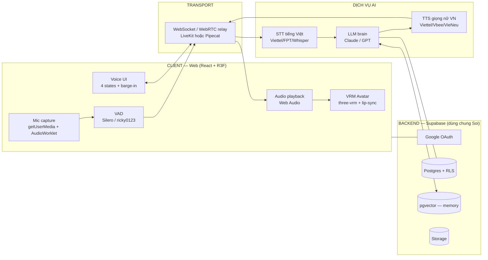
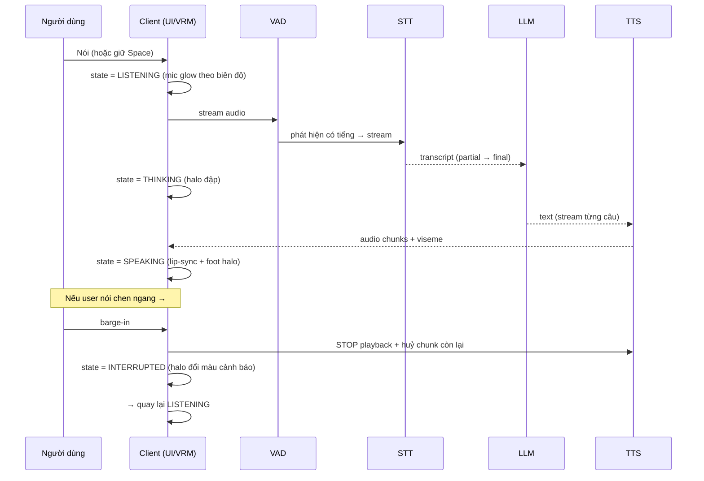
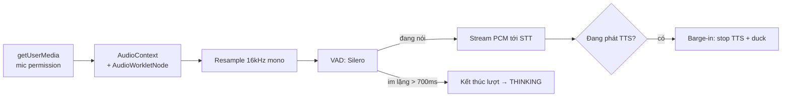

# Mira — Tài liệu Kiến trúc & Công nghệ

> Trợ lý giọng nói 3D • Avatar VRM phong cách anime (hologram) • Web real-time • Tích hợp vào **Soi**
> Phiên bản tài liệu: 0.1 • Đặt tại: `docs/MIRA-KIEN-TRUC.md`

---

## 0. Quyết định đã chốt (đọc cái này trước)

| Hạng mục | Lựa chọn | Ghi chú |
|---|---|---|
| Phong cách avatar | **Anime VRM** (tạo bằng VRoid Studio) | Hologram trong suốt phát sáng → né uncanny valley |
| Render | **three.js + React Three Fiber (R3F)** — real-time WebGL | Đúng "Hướng A", không dùng game engine |
| Pipeline voice | **Chained**: Capture → VAD → STT → LLM → TTS → viseme → VRM | Kiểm soát giọng + chi phí tốt hơn speech-to-speech |
| Giọng nữ tiếng Việt | **Viettel AI TTS / Vbee** (real-time) hoặc **VieNeu-TTS** (self-host) | ElevenLabs cho đa ngôn ngữ; chi tiết §6 |
| Backend | **Supabase** (dùng chung project với Soi) | Auth Google OAuth + RLS sẵn có |
| Triển khai | **Vercel** (app) + **Render** (WS relay real-time) | Đúng đồ nghề hiện tại |
| Đóng gói | Component `<MiraAssistant/>` nhúng được vào Soi | Standalone nhưng integration-first |
| Stack nền | React 18 + TypeScript + SCSS Modules + Vite | Trùng Soi → migrate gần như zero |

---

## 1. Kiến trúc tổng thể



Ý tưởng cốt lõi: client lo **capture + render + UI**, một lớp **transport real-time** nối tới **3 dịch vụ AI** (STT → LLM → TTS), backend Supabase lo **auth + memory + lưu hội thoại**. Lớp transport tách ra để barge-in (ngắt lời) và streaming mượt.

---

## 2. Luồng một lượt hội thoại (kèm barge-in)



Điểm sống còn (mockup tĩnh hay thiếu): **barge-in** phải dừng phát TTS gần như tức thì và đổi trạng thái hình ảnh ngay.

---

## 3. Stack công nghệ theo lớp

| Lớp | Công nghệ | Vì sao |
|---|---|---|
| Khung app | React 18 + TypeScript + Vite + SCSS Modules | Trùng Soi, migrate dễ |
| 3D render | `three`, `@react-three/fiber`, `@react-three/drei` | Chuẩn web 3D, MIT |
| Avatar VRM | `@pixiv/three-vrm`, VRoid Studio (tạo model) | Chuẩn mở cho avatar nhân hình |
| Animation | Mixamo (.fbx) + idle/blink + VRMExpression | Cử chỉ theo mood |
| Lip-sync | `wawa-lipsync` (MVP, free) → Convai/Gabber (nâng cấp) | Viseme/blendshape real-time |
| Thu voice | Web Audio API, `getUserMedia`, AudioWorklet | §5 |
| VAD | `@ricky0123/vad-web` (Silero) | Phát hiện nói / im lặng, bật barge-in |
| Transport | LiveKit hoặc Pipecat (WebRTC/WS) | Streaming + interrupt |
| STT | Viettel AI ASR / FPT.AI / Whisper / Google vi-VN | §7 |
| LLM | Claude / GPT (qua API) | "Bộ não" |
| TTS | Viettel AI / Vbee / VieNeu-TTS / ElevenLabs | §6 — giọng nữ VN |
| Backend | Supabase (Postgres + RLS + pgvector + Storage) | Dùng chung Soi |
| Deploy | Vercel (app) + Render (WS relay) | Hiện có |

---

## 4. Avatar & Lip-sync

- **Tạo avatar:** VRoid Studio (free) → xuất `.vrm`. Phong cách anime "big-eyed", giữ lớp vật liệu trong suốt + emissive để ra cảm giác hologram.
- **Load & điều khiển:** `@pixiv/three-vrm` trong một component R3F thuần (`<VRMScene isSpeaking currentViseme expression />`).
- **Lip-sync (MVP):** `wawa-lipsync` phân tích audio output ngay trên browser → trả viseme → map sang VRMExpression (mouth A/I/U/E/O). Không cần server.
- **Nâng cấp độ mượt:** Convai NeuroSync hoặc Gabber (viseme 60fps, độ trễ < 200ms) khi cần.
- **Biểu cảm theo mood:** Idle (chớp mắt, thở), Happy, Curious, Thinking, Surprised — đổi VRMExpression + chọn animation Mixamo. AI quyết định mood theo ngữ cảnh (giống cách Grok Ani trigger động tác ghi sẵn theo hội thoại).
- **Lưu ý:** với ảnh tĩnh thì theme đổi không nhuộm được nhân vật; **VRM thật thì nhuộm được** (đổi màu emissive theo `--accent`).

---

## 5. Thu voice (audio capture) — chi tiết



Quy tắc kỹ thuật:
- **Quyền mic:** xin `getUserMedia({audio:true})` một lần, xử lý lỗi/deny rõ ràng trong UI (empty state có hướng dẫn).
- **Định dạng:** 16kHz mono PCM cho STT; dùng `AudioWorklet` (không dùng `ScriptProcessor` deprecated).
- **VAD:** `@ricky0123/vad-web` (Silero) chạy on-device → biết khi nào bắt đầu/kết thúc lượt, và để phát hiện **barge-in** trong lúc Mira đang nói.
- **2 chế độ nhập:** push-to-talk (giữ phím/nút) và always-on (VAD tự bật). Cho user chọn.
- **Barge-in:** khi VAD báo có tiếng người trong lúc `state=speaking` → dừng nguồn audio TTS, huỷ queue, chuyển `interrupted` → `listening`.
- **Echo/feedback:** bật `echoCancellation`, `noiseSuppression`, `autoGainControl` trong constraints; cân nhắc duck audio output khi nghe.

---

## 6. Giọng nói nữ tiếng Việt (TTS) — phần quan trọng

Yêu cầu cho hội thoại real-time: **streaming + độ trễ thấp + giọng nữ tự nhiên tiếng Việt**.

| Nhà cung cấp | Giọng nữ VN | Real-time / Streaming | Ưu | Nhược | Khi nào chọn |
|---|---|---|---|---|---|
| **Viettel AI TTS** | Có (đa vùng miền) | Có | Nội địa, hợp ngữ cảnh Viettel, dữ liệu trong nước | Cần tài khoản nội bộ | **Ưu tiên** cho bản Viettel |
| **Vbee AIVoice** | 200+ giọng, đủ B/T/N, nữ | **API Realtime < 3s** (200 ký tự) | Tối ưu cho tiếng Việt (6 thanh điệu), callbot/IVR | Trả phí theo ký tự | Real-time nội địa, nhiều giọng |
| **FPT.AI TTS** | Có (B/T/N, nam/nữ) | Có | Phổ biến, dễ tích hợp, có bản dùng thử | — | Phương án nội địa thứ 2 |
| **VieNeu-TTS** (open-source) | Có (clone 3–5s) | Real-time **CPU**, on-device, 24kHz | **Self-host / on-prem** — dữ liệu không ra ngoài, En-Vi code-switch | Tự vận hành, chất lượng tuỳ bản | Khi cần chạy trong vùng kín / bảo mật cao |
| **ElevenLabs** (Flash/Multilingual) | Có (đa ngôn ngữ + clone) | ~75ms (Flash) | Tự nhiên nhất, đa ngôn ngữ, clone giọng | Tiếng Việt khá nhưng không chuyên sâu; đắt hơn | Khi cần đa ngôn ngữ / giọng cao cấp |
| **Google Cloud / Azure** | vi-VN Neural (nữ) | Có | Ổn định, doanh nghiệp | Giọng "an toàn", ít cảm xúc | Fallback hạ tầng lớn |

**Khuyến nghị cho Mira (Viettel, nội bộ):**
1. **Mặc định:** Viettel AI TTS hoặc Vbee Realtime (giọng nữ miền Bắc, tự nhiên, độ trễ thấp).
2. **Vùng bảo mật cao / on-prem:** VieNeu-TTS (self-host, dữ liệu giữ trong mạng nội bộ — khớp triết lý 3 vùng triển khai của Soi).
3. **Bản đa ngôn ngữ / demo cao cấp:** ElevenLabs Flash.

Lưu ý real-time: ưu tiên TTS **stream theo câu** (gửi từng câu LLM sinh ra) để bắt đầu nói sớm, giảm độ trễ cảm nhận; ghép với lip-sync để mồm khớp âm.

---

## 7. STT (nhận dạng giọng nói) tiếng Việt

| Lựa chọn | Streaming | Ghi chú |
|---|---|---|
| **Viettel AI ASR / FPT.AI ASR** | Có | Nội địa, tốt cho tiếng Việt + vùng miền |
| **Google Cloud STT (vi-VN, Chirp)** | Có | Đa ngôn ngữ, ổn định |
| **Whisper (open-source, self-host)** | Khá (cần streaming wrapper) | Đa ngôn ngữ gồm tiếng Việt, giữ dữ liệu nội bộ |

Cho real-time cần **partial transcript** (hiện caption khi đang nói) → ưu tiên provider hỗ trợ streaming.

---

## 8. LLM (bộ não) + orchestration

- **LLM:** Claude hoặc GPT qua API; system prompt định nghĩa tính cách Mira + ngữ cảnh Soi.
- **Orchestration:** LiveKit Agents hoặc Pipecat điều phối STT↔LLM↔TTS + xử lý interrupt; hoặc tự viết vòng lặp WS nếu muốn gọn.
- **Memory:** lưu hội thoại + embedding vào `pgvector` (Supabase) — tái dùng hạ tầng vector của Soi.
- **Streaming:** LLM stream token → cắt câu → đẩy TTS từng câu (giảm độ trễ).

---

## 9. State machine (4 trạng thái + interrupted)

```ts
type MiraState = 'idle' | 'listening' | 'thinking' | 'speaking' | 'interrupted';

// chuyển trạng thái hợp lệ
const transitions: Record<MiraState, MiraState[]> = {
  idle:        ['listening'],
  listening:   ['thinking', 'idle'],
  thinking:    ['speaking', 'idle'],
  speaking:    ['interrupted', 'listening', 'idle'],
  interrupted: ['listening', 'idle'],
};

// mỗi trạng thái map sang: caption, hành vi waveform/mic, màu halo, biểu cảm VRM
// idle      → thở, halo dịu          | listening → mic glow theo biên độ giọng
// thinking  → halo đập, particle dồn | speaking  → lip-sync + foot halo + waveform output
// interrupted → halo đổi màu cảnh báo, dừng TTS tức thì
```

(Bản mockup `mira.html` đã minh hoạ đúng 5 trạng thái này — dùng làm tham chiếu UI.)

---

## 10. Cấu trúc thư mục đề xuất

```
mira/
├─ src/
│  ├─ core/                 # ENGINE — tách rời UI để nhúng vào Soi
│  │  ├─ state-machine.ts   # 4 + interrupted
│  │  ├─ audio-capture.ts   # getUserMedia + worklet + VAD
│  │  ├─ pipeline.ts        # STT → LLM → TTS orchestration
│  │  ├─ tts/               # adapter: viettel | vbee | vieneu | elevenlabs
│  │  ├─ stt/               # adapter: viettel | whisper | google
│  │  └─ lipsync.ts         # audio → viseme
│  ├─ avatar/
│  │  ├─ VRMScene.tsx       # R3F thuần (props: isSpeaking, viseme, expression)
│  │  └─ animations/        # mixamo fbx, idle, gestures
│  ├─ ui/
│  │  ├─ MiraAssistant.tsx  # COMPONENT NHÚNG ĐƯỢC (entry tích hợp Soi)
│  │  ├─ VoiceDock.tsx      # mic + waveform + caption
│  │  └─ tokens.scss        # --mira-* design tokens (namespace riêng)
│  └─ app/                  # vỏ standalone (chỉ bọc <MiraAssistant/>)
├─ public/avatars/mira.vrm
└─ docs/MIRA-KIEN-TRUC.md
```

Nguyên tắc: **engine (`core/`) không phụ thuộc UI**. Bản standalone chỉ là vỏ mỏng bọc `<MiraAssistant/>`.

---

## 11. Biến môi trường (.env)

```bash
# Supabase (DÙNG CHUNG project với Soi)
NEXT_PUBLIC_SUPABASE_URL=
NEXT_PUBLIC_SUPABASE_ANON_KEY=
SUPABASE_SERVICE_ROLE_KEY=          # chỉ ở server

# LLM
LLM_PROVIDER=claude                  # claude | openai
LLM_API_KEY=

# STT
STT_PROVIDER=viettel                 # viettel | fpt | whisper | google
STT_API_KEY=

# TTS giọng nữ VN
TTS_PROVIDER=viettel                 # viettel | vbee | vieneu | elevenlabs
TTS_API_KEY=
TTS_VOICE_ID=                        # vd: giọng nữ miền Bắc
TTS_VIENEU_ENDPOINT=                 # nếu self-host

# Transport
LIVEKIT_URL=
LIVEKIT_API_KEY=
LIVEKIT_API_SECRET=
```

Không commit `.env`. Đặt secret trên Vercel/Render Environment Variables.

---

## 12. Bảo mật (khớp Soi)

- **Auth:** dùng chung Google OAuth của Soi → đăng nhập Soi là dùng được Mira.
- **RLS:** mỗi user chỉ thấy hội thoại/memory của mình (Postgres Row Level Security — như migration RLS của Soi).
- **3 vùng triển khai:** với vùng kín → dùng STT/TTS self-host (Whisper + VieNeu-TTS) để dữ liệu giọng nói không ra ngoài.
- **Secret:** không để key ở client; gọi LLM/STT/TTS qua server/edge proxy.
- **Quyền hành động:** nếu Mira được phép gọi hành động của Soi (chạy audit, đọc kết quả) → định nghĩa whitelist hành động, không để LLM tự ý gọi tuỳ tiện.

---

## 13. Chi phí ước tính (tham khảo, theo giá 2026)

| Khoản | Đơn giá tham khảo | Ghi chú |
|---|---|---|
| OpenAI Realtime (speech-to-speech) | ~$18/giờ (~$0.30/phút) | Token-based, khó dự báo |
| Chained: STT + LLM + TTS | ~$0.07–0.13/phút | Rẻ hơn, kiểm soát giọng |
| TTS ElevenLabs | ~$0.03–0.10/phút | Cao cấp/đa ngôn ngữ |
| TTS Vbee Realtime / Viettel | Theo gói ký tự nội địa | Thường rẻ hơn cho tiếng Việt |
| VieNeu-TTS (self-host) | Chỉ tốn hạ tầng | Chạy CPU, dữ liệu nội bộ |
| Hosting (Vercel + Supabase + Render) | ~$20–50/tháng (quy mô nhỏ) | three.js miễn phí (MIT) |

Demo ~1.000 phút/tháng: chained ~$70–130/tháng; OpenAI Realtime ~$300/tháng (chưa gồm hosting). **Self-host TTS/STT** kéo chi phí biến đổi xuống đáng kể ở quy mô lớn.

---

## 14. Repo nền tảng để fork (tham khảo)

| Repo | Cho gì | Lưu ý |
|---|---|---|
| `igna-s/Realtime_Avatar_AI_Companion` | VRM anime + voice low-latency (kiểu Ani) | Base khuyên dùng — dễ thay .vrm, giọng, tính cách |
| `gabber.dev` avatar-3d | VRM trong Next.js + Three.js + viseme/STT/LLM/TTS | Hợp Next.js production |
| `Open-LLM-VTuber` | Voice + ngắt lời (barge-in) + memory | Tham chiếu vòng voice (avatar là Live2D 2.5D) |
| `zoan37/ChatVRM` | Chat VRM qua LLM, có demo Vercel | Base kinh điển, MIT |
| Topic `three-vrm` (recently updated) | Có repo trùng stack: R3F + three-vrm + Supabase + Vercel + Google OAuth | Tìm trên github.com/topics/three-vrm |

Tạo giọng/giọng nữ + nhân vật: VRoid Studio (avatar), VieNeu-TTS (clone giọng nữ tiếng Việt nếu cần riêng).

---

## 15. Lộ trình triển khai

| Tuần | Mục tiêu | Đầu ra |
|---|---|---|
| 1 | Scene R3F + load `.vrm` + idle/blink + hologram look | Avatar đứng, thở, đẹp |
| 2 | `wawa-lipsync` + phát một file audio test | Nhân vật nhép miệng |
| 3 | Audio capture + VAD + STT + caption partial | Nghe được, hiện phụ đề |
| 4 | LLM + TTS giọng nữ VN (stream theo câu) | Hội thoại đủ vòng |
| 5 | Barge-in + state machine + mood/biểu cảm | Cảm giác "sống" |
| 6 | Memory (pgvector) + auth Supabase + đo latency | Bản chạy được |
| 7–8 | Đóng gói `<MiraAssistant/>` + nhúng thử vào Soi | Tích hợp |

**Ưu tiên đo latency end-to-end** từ sớm — đó mới là yếu tố quyết định cảm giác thật, không phải polish UI.

---

## 16. Hợp đồng tích hợp Mira ↔ Soi

`<MiraAssistant/>` là điểm nhúng duy nhất. Đề xuất API:

```tsx
<MiraAssistant
  user={currentUser}                 // dùng chung session Soi
  context={{ screen: 'audit', figmaRef, webRef }}  // ngữ cảnh hiện tại của Soi
  voice="vi-VN-female"
  capabilities={['readAuditResult','compareWithFigma']}  // whitelist hành động
  onAction={(action, payload) => { /* Soi xử lý */ }}
  embed="panel"                      // panel | fullscreen | floating
/>
```

Cần chốt sớm (định hình kiến trúc nhiều hơn cả màu sắc): **Mira đóng vai trò gì trong Soi?**
- (a) Trợ lý giọng nói điều khiển audit ("Mira, so màn Login với Figma", "đọc lỗi nghiêm trọng").
- (b) Người dẫn/đọc kết quả audit cho non-dev.
- (c) Mặt tiền hội thoại chung + onboarding.

Vai trò nào → quyết định `capabilities` và những gì Mira được **đọc**/**gọi** từ Soi.

---

## 17. Checklist bắt đầu

- [ ] Tạo avatar `.vrm` trong VRoid Studio (anime, hologram material)
- [ ] Fork repo nền (`igna-s/Realtime_Avatar_AI_Companion` hoặc Gabber)
- [ ] Dựng `VRMScene` R3F + idle/blink, áp tokens `--mira-*`
- [ ] Cắm `wawa-lipsync` với audio test
- [ ] Audio capture + Silero VAD (push-to-talk + always-on)
- [ ] Đăng ký STT + TTS giọng nữ VN (Viettel/Vbee), test streaming
- [ ] Nối LLM (Claude/GPT) + stream theo câu
- [ ] State machine + barge-in
- [ ] Supabase: auth dùng chung Soi + bảng hội thoại + RLS + pgvector
- [ ] Đo latency end-to-end (mục tiêu cảm giác < ~1s)
- [ ] Đóng gói `<MiraAssistant/>` + nhúng thử Soi

---

*Tài liệu này là bản tổng hợp để khởi động; cập nhật khi chốt provider thực tế và vai trò của Mira trong Soi.*
