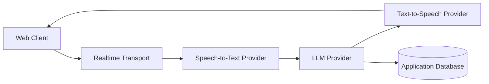

# Mira — Safe Architecture Notes

This document intentionally contains only synthetic, provider-neutral architecture notes. It must not include internal customer names, organization names, private screenshots, production URLs, API keys, tokens, database strings, or confidential deployment details.

## Scope

Mira is a web voice assistant prototype with a 3D avatar, real-time voice interaction, and pluggable AI services.

## High-level architecture

## Approved provider naming

Use generic labels in public repositories:

- `STT Provider`
- `TTS Provider`
- `LLM Provider`
- `Application Database`
- `Object Storage`
- `Realtime Relay`

Do not commit customer-specific names, internal domains, live credentials, screenshots, or sample data derived from a real organization.

## Security rules

1. Keep all secrets in deployment secret stores only.
2. Commit only `.env.example` files with fake values.
3. Use synthetic test users such as `admin@example.com` and `qa@example.com`.
4. Use synthetic screenshots and generated fixtures for eval/test data.
5. For confidential/private deployments, use local/self-hosted adapters and never route private input to third-party APIs without approval.
